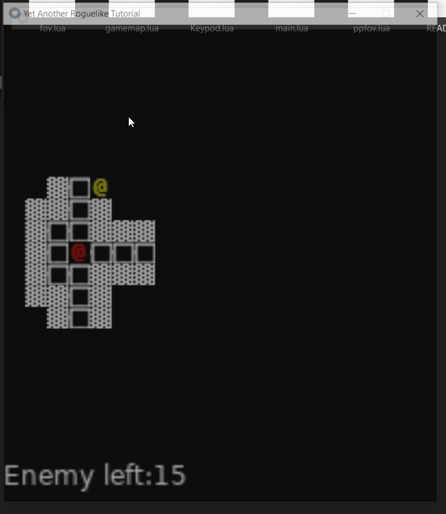

# Yet another roguelike tutorial

Based on [tutorials from r/RoguelikeDev](https://www.reddit.com/r/roguelikedev/comments/1dt8bqm/roguelikedev_does_the_complete_roguelike_tutorial/)

## Day 0
It starts from choosing the enviroment. 
I started project in ZeroBrane Studio, but suddenly became aware about [kickstart.nvim](https://youtube.com/watch?v=m8C0Cq9Uv9o) project by TJ DeVries.  
It, with some [advices](https://youtube.com/watch?v=w7i4amO_zaE) from ThePrimeagen, pushed me deep in a rabbit hole.  
I learned a fair share about NeoVim, it's plugins, some new stuff about fuzzy-finder and tree-sitter, realized that LSP are a new norm, so a lot.

All this time i wasn't making progress. 
Single _@_ sign was moving slowly and lonely in labyrinth made from a single wall strunged across screen. 

Tomorrow. Tomorrow i will hike through Roguelike tutorial blazingly fast, you'll see.

## Day 0 for real
Setting up. Yeah i didn't use python here, this project is written in lua.   
TCOD library? I bet it is python bound.  
Dejavu font png downloaded.
Chosen editor fired up, ready to roll.

## Day 1 err, Part 1
Love2d project is easy to start, no problems here.  
Now, i dont know what is wrong with python that it can invoke font\charset from a png file, and use it with colorcoding. Here in graphical realm, i will slice up image in quads and use them.

Moving a picture on a screen, using keystrokes is not very intimidating, so no problems here.

## Part 2
Lua is heavily functional language, so it will be pretty unoptimal to work with Entity-oriented approach. And i will suffer greatly in the future. But will go on.

Setting up different version of tiles and a map of them was suddenly a big problem, but then i hardcoded Scale, WorldSize, FontSize, and get very happy.

After this i reworked the gamemap to be a real 2d array, not a pixels array, and after it i switched to Neovim.

Oh boy, so many warnings. 

## Part 3
Things i lack at this moment: engine, event queue, color tokens. But that won't stop me from generation a dungeon!

Dungeon was generated, with some hiccups (mostly counting by 1 error), now there is FOV problem. 

TCOD just gives a solution, but didn't disclose underlying mechanic. Well, then i will search elsewhere.

My first reaction was to use Love2d wiki and i found some FOV [implementation](https://github.com/markandgo/Lua-FOV) that worked just as you expect for 11yo code snippet for a highly evolving framework.

Now to fixing it... It has really helpful links to roguebasin with detailed explanations of algorhitms.
Algoritm found on roguebasin (of all the places) was leading to the site of one [Adam Milazzo](http://www.adammil.net/blog/v125_roguelike_vision_algorithms.html)
Well, nice code and comments and all, and yet some errors, which made me tear hair out. But now!!
Now The Fov is working and i am already moving to part 5! Other agents and interacting!

## Part 5  
that was surprisingly easy, after FOV stuff. Spawn enemies, then spawn some more. New check at movement if enemy is blocking the way. 

I always think it is too risque to recheck all array of elements, but now computers are so powerfull and fast. Just don't let me write any AAA products.

Hitting the enemies. tutorial suggest writing log of things, and i just table.removed() them. Felt nice to see token disappear after interaction. 

### What is a good devlog without pictures?
I present you THE GIF!

